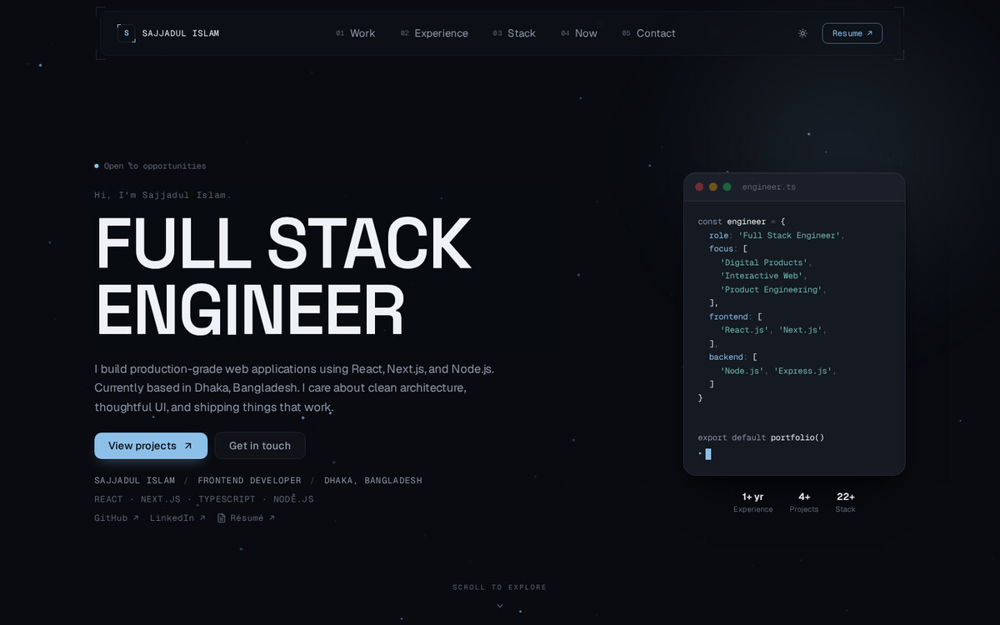
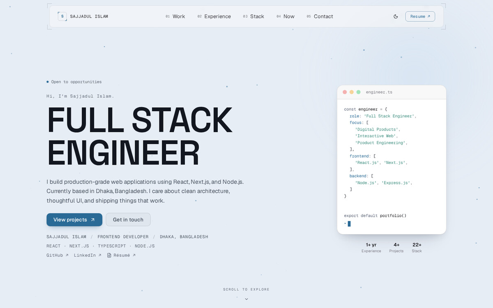
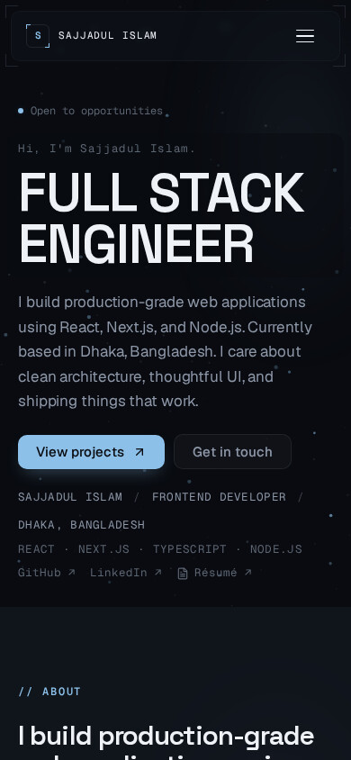
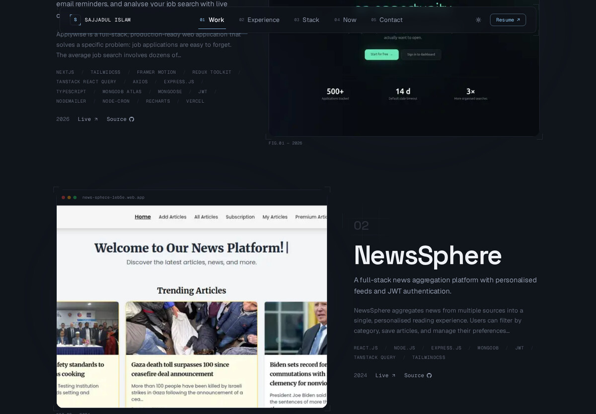
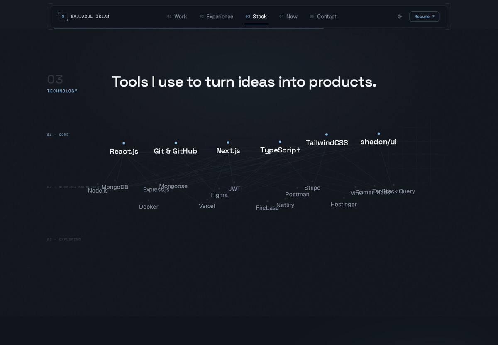

<div align="center">

# Sajjadul Islam — Portfolio Platform

**A production-grade personal portfolio & CMS.** Next.js App Router, TypeScript, TailwindCSS, MongoDB — a public site and a password-protected admin CMS, driven by the same data, deployed as one app.

[](https://nextjs.org)
[](https://typescriptlang.org)
[](https://tailwindcss.com)
[](https://mongodb.com)
[](https://www.framer.com/motion/)
[](https://docker.com)
[](https://vercel.com)
[](LICENSE)

[Live Site](https://sajjadulislam.vercel.app) · [Admin Panel](https://sajjadulislam.vercel.app/admin) · [Report a Bug](https://github.com/sajjadislam523/portfolio/issues)

</div>

<br>

<p align="center">
  
</p>

<p align="center">
  
  
</p>

<br>

This isn't a template — it's a fully custom-built platform, designed around one deliberate visual identity (**Cinematic Technical / Sci-Fi Editorial**: a near-black environment lit by a single cold-blue accent, oversized editorial typography, restrained monospace technical metadata, one-time entrance reveals instead of continuous animation) and carried through every surface, including the admin CMS that manages it.

## Contents

- [Features](#features)
- [Design language](#design-language)
- [Tech stack](#tech-stack)
- [Quick start](#quick-start)
- [Environment variables](#environment-variables)
- [Deployment](#deployment)
- [Admin panel](#admin-panel)
- [Command palette](#command-palette)
- [Project structure](#project-structure)
- [Scripts](#scripts)
- [Local dev workflow](#local-dev-workflow)
- [License](#license)

## Features

### Public site

- A minimal HUD-style command navigation — index-numbered links, a
  `layoutId`-animated active indicator, scroll-aware translucency, and a
  full-screen mobile overlay with its own reveal choreography (not a
  shrunk desktop menu)
- Editorial hero with a terminal-style code card and live stats — the
  panel sits beside the text at desktop widths and hides below `1024px`
  instead of stacking, so the hero stays proportionate on a phone
  instead of pushing content off-screen
- Editorial About/Capabilities section
- Case-study project pages: overview, challenges, solutions, image
  gallery, and tech stack per project — unpublished projects 404 on
  their direct URL, not just absent from the listing
- Interactive experience timeline
- Categorized tech stack with proficiency tiers (Core / Working
  knowledge / Exploring), rendered as an interactive constellation on
  desktop and a clean stacked list on mobile — not a shrunk graph
- "Currently Exploring" — what's actively being learned right now
- Contact form that writes straight to a MongoDB inbox, with
  loading/success/error states and properly labelled fields
- Command palette (`⌘K` / `Ctrl+K`) for navigation and theme switching
- Light/dark theme toggle — visitor-controlled, remembered per browser,
  no flash of the wrong theme on load (a blocking inline script sets
  the theme class before first paint)
- A favicon derived from the same monogram as the navbar logo, adapting
  to the browser's light/dark preference from a single SVG file
- Full SEO: dynamic sitemap, `robots.txt` (admin/API routes disallowed),
  JSON-LD structured data, per-page Open Graph + Twitter card metadata,
  theme-color meta tags matching the site's own light/dark tokens

### Admin CMS

Everything under `/admin`, protected by JWT auth, organized into four groups
(Content / Media / Site / System) plus a standalone dashboard:

| Group | Section | What it manages |
| --- | --- | --- |
| — | **Dashboard** | Stats overview + recent messages |
| Content | **Profile** | Name, title, bio, avatar |
| Content | **Hero** | Landing headline, subheading, terminal-card copy |
| Content | **Projects** | Full CRUD — slug, tagline, overview, challenges, solutions, stack, links, gallery images, published/featured/archived state |
| Content | **Experience** | Inline expandable work-history manager |
| Content | **Stack** (Skills) | Category-grouped, with proficiency tiers |
| Content | **Currently Exploring** | What's being learned right now — reorderable, with an active/primary/completed state |
| Content | **Certifications** | Simple list manager |
| Media | **Files** | Shared media library (Vercel Blob-backed) used by project galleries, avatar, OG image |
| Media | **Resume** | Upload new resume versions, pick the active one, delete old versions — the public Resume button always points at whichever version is marked active |
| Site | **Navigation** | Live state of what drives the public nav bar (resume link, availability, Currently Exploring) |
| Site | **Social Links** | GitHub, LinkedIn, etc. |
| Site | **SEO** | Title, description, keywords, OG image |
| System | **Messages** | Contact-form inbox — read / archive / delete, with toast feedback on each action |
| System | **Settings** | Site-wide system settings (availability toggle, etc.) |

Changes go live on the public site within 5 minutes via ISR, or immediately
via on-demand revalidation for anything that touches the resume or hero —
no redeploy needed.

### Under the hood

- Next.js App Router, React Server Components throughout
- Server Actions for every CMS mutation — no separate REST/API layer
- Incremental Static Regeneration — pages are edge-cached, MongoDB is only
  hit on revalidation; per-request data loaders are wrapped in React's
  `cache()` so `generateMetadata` and the page body don't double-query
- JWT auth in httpOnly cookies, with HTTPS-aware cookie flags (no `Secure`
  flag on plain HTTP, so local-network testing doesn't break)
- A shared `error.tsx` boundary and `not-found.tsx` page, same visual
  language, so an unexpected error never shows a framework default screen
- Docker-ready: multi-stage Alpine build, standalone output, non-root user
- Zero unused dependencies — every package in `package.json` is actually
  imported somewhere in `src/`

## Design language

**Cinematic Technical / Sci-Fi Editorial.** Every section is built around
exactly one visual idea — the hero is atmosphere and a star field, Projects
is editorial case-study composition, Experience is a technical timeline,
Stack is a technology constellation, Contact is a cinematic final scene —
carried through a strict hierarchy: **typography > composition >
project visuals > atmosphere > interaction > decoration**. Decoration never
outranks what's above it.

<p align="center">
  
  
</p>

Dark mode is the primary identity (multiple near-black surface levels, not
one flat black, lit by a single cold-blue accent used as a light source —
never a decorative glow). Light mode is its own considered, warmer/paper-toned
treatment, not an inverted palette. Motion is restrained by design: one-time
entrance reveals plus small, purposeful hover feedback — never continuous or
decorative animation. The acceptance bar for any new work on this site: it
must still look beautiful with all animation disabled, decorations removed,
and colors stripped — hierarchy has to survive on type and spacing alone.

## Tech stack

| Layer | Technology |
| --- | --- |
| Framework | Next.js 16 (App Router, Turbopack) |
| Language | TypeScript |
| Styling | TailwindCSS v4 + CSS custom properties |
| Database | MongoDB + Mongoose |
| Auth | JWT in httpOnly cookies |
| Animation | Framer Motion + CSS transitions |
| Forms | React Hook Form + Zod |
| File storage | Vercel Blob |
| Deployment | Docker / Vercel |

## Quick start

**Prerequisites:** Node.js 20+, npm, and a MongoDB instance (local, or a free [Atlas](https://cloud.mongodb.com) cluster).

```bash
# 1. Clone and install
git clone https://github.com/sajjadislam523/portfolio.git
cd portfolio
npm install

# 2. Configure environment
cp .env.local.example .env.local
# then fill in .env.local — see "Environment variables" below

# 3. Seed the database (creates the admin user + sample content)
npm run seed

# 4. Run it
npm run dev
```

| URL | What's there |
| --- | --- |
| `http://localhost:3000` | Public portfolio |
| `http://localhost:3000/admin/login` | Admin login |

## Environment variables

Copy `.env.local.example` to `.env.local` and fill these in:

| Variable | Required | Description |
| --- | --- | --- |
| `MONGODB_URI` | Yes | MongoDB connection string |
| `JWT_SECRET` | Yes | 64-char random hex. Generate with `node -e "console.log(require('crypto').randomBytes(64).toString('hex'))"` |
| `ADMIN_EMAIL` | Yes, for seeding | Admin login email — used once by `npm run seed` to create the account |
| `ADMIN_PASSWORD` | Yes, for seeding | Admin password — hashed by the seed script, change it after first login |
| `NEXT_PUBLIC_URL` | Yes | Full deployment URL, no trailing slash — used for sitemap, OG images, metadata |
| `BLOB_READ_WRITE_TOKEN` | Optional | Vercel Blob token, for resume/image uploads. Leave empty to skip upload functionality |
| `NEXT_PUBLIC_ANALYTICS_ENABLED` | Optional | Set to `true` to enable page-view tracking to MongoDB |

## Deployment

### Vercel (recommended)

```bash
npm i -g vercel
vercel --prod
```

Set the environment variables from the table above in your Vercel project dashboard, then seed the production database once:

```bash
npm run seed
```

### Docker (self-hosted / local network)

```bash
# Point NEXT_PUBLIC_URL at your machine's address in .env.local, e.g.:
# NEXT_PUBLIC_URL=http://192.168.1.x:3000

cd docker
docker compose --env-file ../.env.local up --build -d

# Tail logs
docker logs portfolio_app -f
```

The app is then reachable from any device on the network at `http://192.168.1.x:3000`.

## Admin panel

Log in at `/admin/login` with the credentials from `.env.local`.

| Page | Purpose |
| --- | --- |
| `/admin/dashboard` | Stats overview + recent messages |
| `/admin/profile` | Name, title, bio, avatar |
| `/admin/hero` | Landing hero content |
| `/admin/projects` | CRUD for portfolio projects |
| `/admin/experience` | Work history management |
| `/admin/skills` | Tech stack by category |
| `/admin/exploring` | Currently-exploring list |
| `/admin/certifications` | Courses and certifications |
| `/admin/media` | Shared file/media library |
| `/admin/resume` | Resume version management |
| `/admin/navigation` | Live state of what drives the public nav |
| `/admin/social-links` | Social profile links |
| `/admin/seo` | SEO metadata and OG image |
| `/admin/messages` | Contact form inbox |
| `/admin/settings` | System settings (availability toggle, etc.) |

## Command palette

Open it with **⌘K** (Mac) or **Ctrl+K** (Windows/Linux) from any public page.

| Command | Action |
| --- | --- |
| Navigate → Home / Projects / Experience / Stack / Contact | Jump to that page |
| Download Resume | Opens the active resume PDF |
| Switch to light/dark theme | Toggles the site theme |

## Project structure

```text
src/
├── app/
│   ├── (public)/            # Public portfolio pages
│   │   ├── page.tsx         # Landing page (hero, about, stack, projects, exploring, contact)
│   │   ├── projects/        # Projects list + detail ([slug])
│   │   ├── experience/      # Career timeline
│   │   ├── stack/           # Tech ecosystem
│   │   └── contact/         # Contact form
│   ├── (admin)/admin/       # Admin CMS (JWT protected)
│   │   ├── login/
│   │   └── (protected)/
│   │       ├── dashboard/            # standalone
│   │       ├── profile/  hero/  projects/  experience/
│   │       ├── skills/  exploring/  certifications/    # ── Content group
│   │       ├── media/  resume/                          # ── Media group
│   │       ├── navigation/  social-links/  seo/          # ── Site group
│   │       └── messages/  settings/                      # ── System group
│   ├── api/
│   │   ├── auth/            # Login / logout routes
│   │   └── upload/          # File uploads (resume, images) via Vercel Blob
│   ├── icon.svg              # Favicon (adapts dark/light)
│   ├── apple-icon.png        # iOS home-screen icon
│   ├── error.tsx              # Shared error boundary
│   ├── not-found.tsx          # Shared 404 page
│   ├── sitemap.ts
│   └── robots.ts
├── components/
│   ├── admin/                 # Admin UI components (AdminSidebar, FormField, Modal, MediaPicker, ...)
│   ├── sections/               # Public page sections (hero, about, experience, projects, stack, exploring, contact)
│   ├── shared/                 # NavClient, Logo, CommandPalette, JsonLd, SectionAtmosphere, TechnicalMotifs, SiteFooter
│   └── motion/                 # ScrollReveal
├── features/                   # Server Actions, grouped by domain
│   ├── projects/  experience/  skills/  certifications/  exploring/  media/  settings/  contact/  auth/
├── lib/
│   ├── db/                     # MongoDB connection + Mongoose models
│   ├── auth/                   # JWT sign/verify
│   └── validations/            # Zod schemas
└── types/                      # Shared TypeScript interfaces
```

## Scripts

| Command | What it does |
| --- | --- |
| `npm run dev` | Start the dev server (Turbopack) |
| `npm run build` | Production build |
| `npm run start` | Run the production build |
| `npm run lint` | ESLint |
| `npm run seed` | Create the admin user + sample content |
| `npm run backup:db` | Read-only snapshot of every collection before running a migration |
| `npm run migrate:skill-tier` | One-off: migrate legacy `Skill.proficiency` → `Skill.tier` |
| `npm run migrate:exploration-status` | One-off: backfill `Exploration.status` |
| `npm run migrate:resume-filename` | One-off: backfill resume version filenames |
| `npm run backfill:cms-defaults` | One-off: backfill defaults for CMS documents saved before a field existed |

## Local dev workflow

This repo uses a git alias to keep a `development` branch rebased cleanly onto `main`.

```bash
# One-time setup on a new machine
git config alias.syncdev "!git checkout main && git pull && git checkout development && git rebase main"
```

From then on, run `git syncdev` whenever you want to sync — it checks out `main`, pulls the latest, switches back to `development`, and rebases your work on top.

## License

MIT — see [LICENSE](LICENSE). Feel free to use this as inspiration, but please don't deploy it as-is with someone else's content.

<div align="center">

Designed & built with ❤️ by **Sajjadul Islam**

[sajjadulislam.vercel.app](https://sajjadulislam.vercel.app) · [GitHub](https://github.com/sajjadislam523) · [LinkedIn](https://linkedin.com/in/sajjadislam523)

</div>
